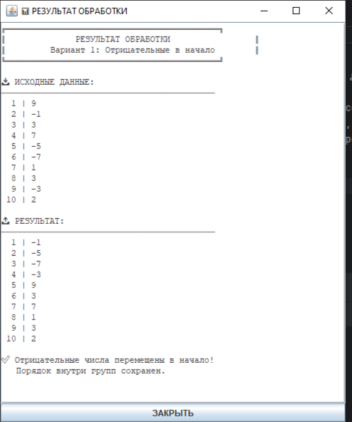

# Лабораторная работа №4 - Обработка данных

## 🎯 Описание варианта

**Вариант 1:** Перемещает все отрицательные числа в начало списка, сохраняя их исходный относительный порядок, а остальные числа — в конец.

### Пример работы:

## Разработал студент группы зБИСТ - 231
## Полатай Виктор